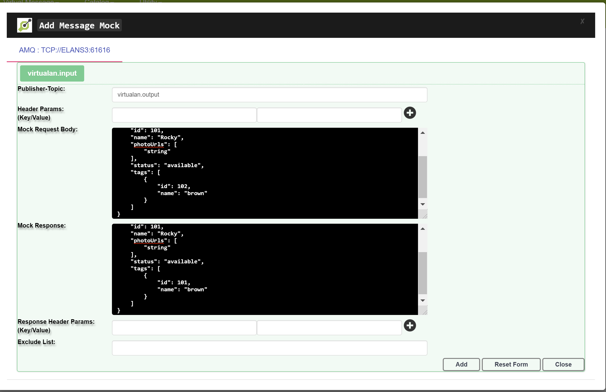

# Active MQ - Virtulization

[](https://search.maven.org/search?q=g:%22io.virtualan%22%20AND%20a:%22virtualization%22)


## What it is
>  Allows to Virtualize/Mocking message for Active AQ.virtualization is a Service virtualization Product and is the simulation of the behavior of Open API that are unavailable or otherwise restricted during the preproduction stage of the software development lifecycle. 
Virtualization has RESTAPI and user-friendly interface (UI) to set up the test data for your specific type of Rest APIs. This UI would help Developer, Functional Tester or Automation Tester to set up the test data for their specific use cases and test scenarios 

## Project setup/Live demo

 |Project|  
 |----------:|
  |[AMQ Service Virtualization Project](https://github.com/virtualansoftware/virtualan/tree/master/samples/virtualan-amq)  |

## Maven dependency
```mvn 
<dependency>
	<groupId>io.virtualan</groupId>
	<artifactId>virtualaization</artifactId>
	<version>${virtualan.version}</version>
</dependency>
``` 

## How to Integrate
1. create JSON Message with following format and create file in the classpath conf/jms-config.json   
> "receiver-queue" :  Add all queue name will consume the produce mock message

```JSON
{
  "AMQ" : [
      {
        "systemName": "<Application/Service Name>",
        "broker-url" : "<Broker URL>",
        "user": "<UserName>",
        "password" :"<Password>",
        "receiver-queue": ["queue Name1", "queue Name2"]   
      }
  ]
}
```
**Example:**
```JSON
{
  "AMQ" : [
      {
        "systemName": "Virtualan-AMQ-1",
        "broker-url" : "tcp://virtualan:61616",
        "user": "admin",
        "password" :"admin",
        "receiver-queue": ["virtualan.input"]
      }
  ]
}
```

## How to add Mock data
> Adding Message Mock data




----