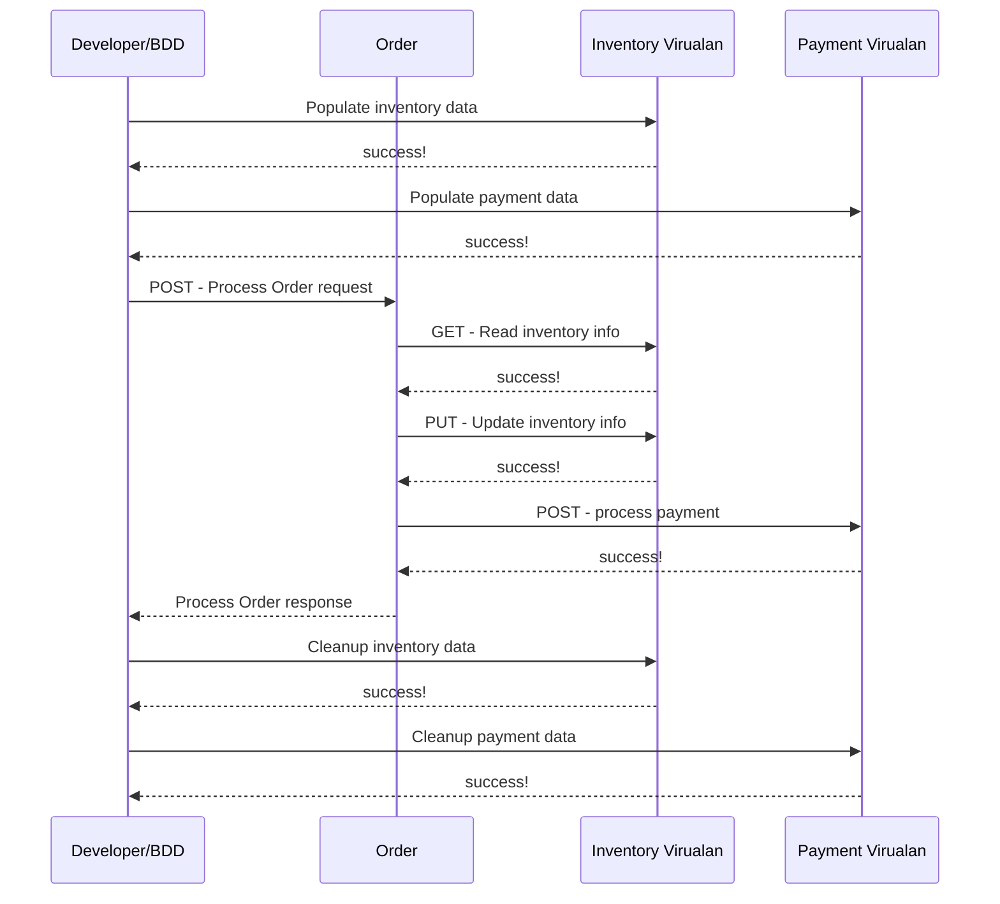

# Developer Usecase Scenario:

### Developer building unit test change in Test Driven Development  ( i.e. prior to code and check in)
As an Integration developer, I want to test out my code using the defined contract, so that I can test before the service is fully complete.

### Acceptance Criteria
1 - able to build data
2 - able to execute requests (get, post, delete, patch, etc.)

## How can I use Virtualan Service Virtualization to help this use case?
**As a developer**, I am developing an Order Micro service. Order service is integrated with Inventory and Payment micro services.
In the development environment, Inventory and Payment micro service would not be stable. As it is a development environment that the development team would keep updating and testing changes for each microservices. 

How can I test my(Order) microservice without using development Inventory and Payment services  

## Sequence Diagram

Toggle me!

### Step 1: Virtual services come to play
- As you can get the Inventory and Payment contracts from the development team. 
- Add the contract to the Virtualan Service virtualization Product
    Virtualan is a contract driven Virtualization Product and can be done in minutes. 
- Which will create Virtualize service/Mock service for the provided contract.

### Step 2: Pre Populate the data using the Virtualan rest api client
- Add mock data for Inventory and Payment services using Virtualan REST API Client.
- Store the Unique Identifier for each mock data created. 

### Step 3: Run the Test case:
- Execute the Order API for the given Scenario
- Validate the response for the given Scenario as Expected.

### Step 4: Clean up the mock data:
- Run Virtualan REST API client to clean up data created During prepopulation step. 

----