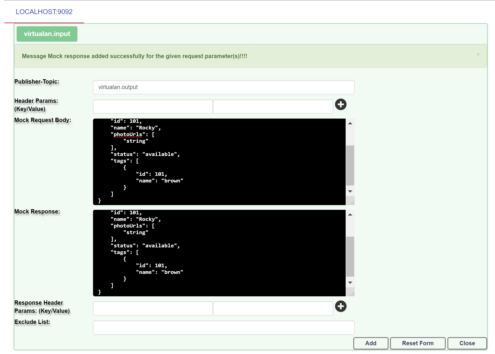

# Kafka - Virtualization

[](https://search.maven.org/search?q=g:%22io.virtualan%22%20AND%20a:%22virtualization%22)


## What it is
>  Allows to Virtualize/Mocking message for Kafka. Virtualization is a Service virtualization Product and is the simulation of the behavior of Open API that are unavailable or otherwise restricted during the preproduction stage of the software development lifecycle. 
Virtualization has RESTAPI and user-friendly interface (UI) to set up the test data for your specific type of Rest APIs. This UI would help Developer, Functional Tester or Automation Tester to set up the test data for their specific use cases and test scenarios 

## Project setup/Live demo

 |Project|  
 |----------:|
  |[AsyncAPI Kafka Service Virtualization Project](https://github.com/virtualansoftware/asyncapi-virtualization)  |

## Maven dependency
```mvn 
<dependency>
	<groupId>io.virtualan</groupId>
	<artifactId>virtualization</artifactId>
	<version>${virtualan.version}</version>
</dependency>
``` 

## How to Integrate
1. create CONFIG with following format and create file in the classpath under conf/kafka.json   
> "topics" :  Add all topics will consume and then produce mock response message

```JSON
{
  "Kafka" : [
    {
      "broker" : "<broker address>",
      "topics": [
          "<topic name1>", "<topic name2>"
      ],
      "consumer" : "<consumer properties>",
      "producer" : "<producer properties>"
    }
  ]
}
```
**Example Config:**
```JSON
{
  "Kafka" : [
    {
      "broker" : "localhost:9092",
      "topics": [
          "virtualan.input", "virtualan.output"
      ],
      "consumer" : "consumer.properties",
      "producer" : "producer.properties"
    }
  ]
}
```

## How to add Mock data
### Adding Message Mock data via REST API
- API endpoint: http://localhost:8800/virtualservices/message
- Http Action: Post

```JSON
{
    "resource": "virtualan.input",
    "brokerUrl": "localhost:9092",
    "requestTopicOrQueueName": "virtualan.input",
    "input": "{\n    \"category\": {\n        \"id\": 100,\n        \"name\": \"German Shepherd\"\n    },\n    \"id\": 101,\n    \"name\": \"Rocky\",\n    \"photoUrls\": [\n        \"string\"\n    ],\n    \"status\": \"available\",\n    \"tags\": [\n        {\n            \"id\": 101,\n            \"name\": \"brown\"\n        }\n    ]\n}",
    "output": "{\n    \"category\": {\n        \"id\": 100,\n        \"name\": \"German Shepherd\"\n    },\n    \"id\": 101,\n    \"name\": \"Rocky\",\n    \"photoUrls\": [\n        \"string\"\n    ],\n    \"status\": \"available\",\n    \"tags\": [\n        {\n            \"id\": 101,\n            \"name\": \"brown\"\n        }\n    ]\n}",
    "responseTopicOrQueueName": "virtualan.output",
    "availableParams": [],
    "headerParams": []
  }
```

### Adding Message Mock data via UI




## How to view Mock data
### View Message Mock data via REST API
> Access via following rest endpoint ad JSON format: http://localhost:8800/virtualservices


### View Message Mock data via UI


----
