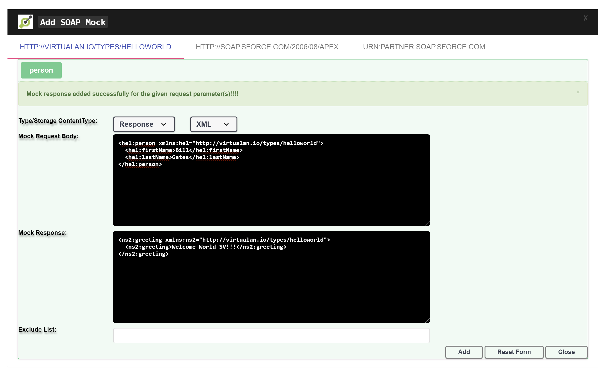
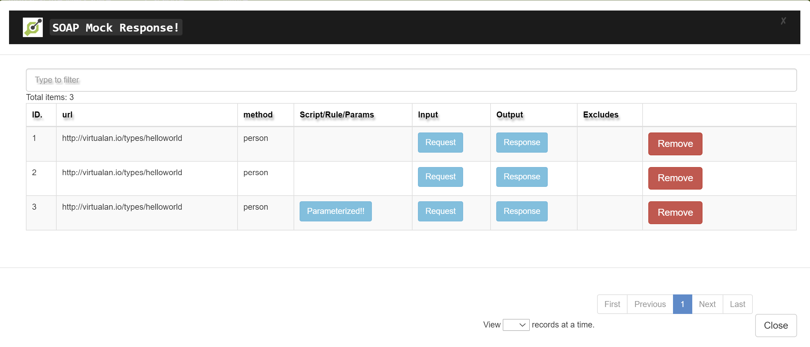

# WSDL SOAP - Virtualization

[](https://search.maven.org/search?q=g:%22io.virtualan%22%20AND%20a:%22virtualization%22)


## What it is
>  Allows to Virtualize/Mocking for SOAP WSDL. Virtualization is a Service virtualization Product and is the simulation of the behavior of Open API that are unavailable or otherwise restricted during the preproduction stage of the software development lifecycle. 
Virtualization has RESTAPI and user-friendly interface (UI) to set up the test data for your specific type of Rest APIs. This UI would help Developer, Functional Tester or Automation Tester to set up the test data for their specific use cases and test scenarios 

## Project setup/Live demo

 |Project|  
 |----------:|
  |[SOAP Service Virtualization Project](https://github.com/virtualansoftware/virtualan/tree/master/samples/virtualan-wsdl-soap)  |

## Maven dependency
```mvn 
<dependency>
	<groupId>io.virtualan</groupId>
	<artifactId>virtualization</artifactId>
	<version>${virtualan.version}</version>
</dependency>
``` 

## How to Integrate
1. Add each wsdl in the following wsdl options in pom.xml   

```XML
<wsdlOption>
    <wsdl>${basedir}/src/main/resources/META-INF/resources/wsdl/Hello/helloworld.wsdl</wsdl>
    <extraargs>
    <extraarg>-xjc-Xequals</extraarg>
    <extraarg>-xjc-XhashCode</extraarg>
    <extraarg>-xjc-XtoString</extraarg>
    </extraargs>
    <bindingFiles>
    <bindingFile>${project.basedir}/src/main/resources/xjb/bindings.xjb</bindingFile>
    </bindingFiles>
</wsdlOption>
```

2. Refer Pom.xml for more details
> https://github.com/virtualansoftware/virtualan/blob/master/samples/virtualan-wsdl-soap/pom.xml

## How to add Mock data
### Adding Message Mock data via REST API
- API endpoint: http://localhost:8800/virtualservices/soap
- Http Action: Post

```JSON
{
    "url": "http://virtualan.io/types/helloworld",
    "type": "Response",
    "input": "<hel:person xmlns:hel=\"http://virtualan.io/types/helloworld\">\n  <hel:firstName>Bill</hel:firstName>\n  <hel:lastName>Gates</hel:lastName>\n</hel:person>",
    "output": "<ns2:greeting xmlns:ns2=\"http://virtualan.io/types/helloworld\">\n  <ns2:greeting>Welcome World SV!!!</ns2:greeting>\n</ns2:greeting>",
    "contentType": "XML",
    "method": "person"
}

```

### Adding Message Mock data via UI




## How to view Mock data
### View SOAP Mock data via REST API
> Access via following rest endpoint ad JSON format: http://localhost:8800/virtualservices


### View SOAP Mock data via UI



----
